<picture>
  <source media="(prefers-color-scheme: dark)" srcset="banner-dark.svg">
  
</picture>

  
  
  
  

I'm a second-year computer science student at Cal State Fullerton, graduating in May 2029. Most of my code is TypeScript backends: payments, job queues, and real-time updates. I also build open-source developer tools and Roblox games.

In September 2026 I started Stelta, a small software studio, after other nightlife businesses saw the ticketing site I was building for my first client.

## Right now

- Running Stelta and building its first client's ticketing site, Adventure World (pre-launch).
- Writing machine learning benchmark tasks for the Handshake AI Fellowship. They test whether AI coding agents can keep a model-serving system correct through crashes, timeouts, and repeated messages. Both tasks I submitted were accepted.
- Teaching algorithm workshops on the ACM Algorithm Board at CSUF. I'm also a ColorStack member.

<table>
  <tr>
    <td align="center" width="20%"><h3>25M+</h3>visits on Roblox games I led</td>
    <td align="center" width="20%"><h3>1st place</h3>LPL Financial Hackathon, as team lead</td>
    <td align="center" width="20%"><h3>1st + $6K</h3>grant at CSUF's Engineering Social Justice competition</td>
    <td align="center" width="20%"><h3>1,400+</h3>npm downloads for MetricHouse in its first month</td>
    <td align="center" width="20%"><h3>3h → 30m</h3>for a log filing task I automated at K.T. Engineering</td>
  </tr>
</table>

## Projects

<table>
  <tr>
    <td width="50%" valign="top">
      <h3><a href="https://github.com/TheBigJ3/MetricHouse">MetricHouse</a></h3>
      
Most metrics tools make you run extra servers or pay for a hosted service before you can count anything. MetricHouse counts sign-ups, sales, and other app metrics inside the TypeScript app you already run, and a server crash doesn't lose the counts.

      
<b>1,400+ npm downloads in its first month · about 1,200 tests · 8 releases</b>

      TypeScript · Redis · Lua · <a href="https://www.metrichouse.dev/">docs</a>
    </td>
    <td width="50%" valign="top">
      <h3><a href="https://github.com/TheBigJ3/Murmur">Murmur</a></h3>
      
Load testers usually call the same endpoint in a loop, but real users sign in, browse, buy, and leave in a certain order. Murmur sends traffic shaped like that. An AI agent reads your code to map the paths users take, and personas decide how each kind of user behaves.

      
<b>317 tests · 8 releases in 2 days</b>

      Python · Locust · AI agent skills
    </td>
  </tr>
  <tr>
    <td width="50%" valign="top">
      <h3><a href="https://github.com/TheBigJ3/LPL-Hacks">Backbone</a></h3>
      
A financial advisor told us he digs through several dashboards to find one client's documents. Backbone reads and tags those documents so LPL's AI assistant can answer advisor questions from the right files. I designed the architecture and was named team lead partway through the build.

      
<b>1st place, LPL Financial Hackathon · team of 5</b>

      TypeScript · AWS Textract · SageMaker (GPU) · PostgreSQL
    </td>
    <td width="50%" valign="top">
      <h3>Adventure World (private repo)</h3>
      
An events brand whose events draw thousands of people was selling tickets on a marketplace that took 12% + $1.25 each and kept its customer data. I'm building its own site at 3.5% + $0.50 per ticket, with checkout, ticket transfers, and QR scanning at the door. Redis holds tickets during checkout so an event can't oversell.

      
<b>About 69% lower fees per ticket · 277 of 536 commits · pre-launch</b>

      TypeScript · Stripe Connect · Postgres · Redis · BullMQ · ClickHouse
    </td>
  </tr>
  <tr>
    <td width="50%" valign="top">
      <h3>Roblox games</h3>
      
I led <i>Dig and Shoot</i>, built with YouTube creator RiceGum, and <i>Moo Legacy</i>, where I designed the core systems and managed 2 scripters. In Dig and Shoot the server checks each shot against where players stood, so faked hits get rejected.

      
<b>25M+ combined visits · Dig and Shoot hit 1.7M+ visits in one month</b>

      Luau · Roblox
    </td>
    <td width="50%" valign="top">
      <h3><a href="https://github.com/TheBigJ3/pre-market-news-analyzer">Pre-Market News Analyzer</a></h3>
      
Traders want to know if the news since yesterday's close is good or bad before the market opens. This app collects a stock's overnight news with six search agents running in parallel, then makes a call for each trading day without ever seeing prices.

      
<b>Accuracy went from 73.3% to 86.7% on a 15-case hand-labeled test set</b>

      Next.js · OpenAI structured outputs · Exa
    </td>
  </tr>
</table>

More:

- [Nested](https://github.com/shanesharma/ESJ2026): a caregiver phone app for a Bluetooth wearable that lets assisted-living residents call for help, replacing paper logs and texts on staff's personal phones. Won 1st place and a $6,000 grant at CSUF's Engineering Social Justice competition. React Native, BLE.
- [Windows Controller Keybinder](https://github.com/TheBigJ3/Windows-Controller-Keybinder): I moved into a college apartment with no keyboard or mouse, and Windows can't move the cursor from an Xbox controller. This C++ tool lets the controller run the whole PC.
- [Impromptu](https://github.com/TheBigJ3/Impromptu): a Chrome extension for Google's Chrome Built-in AI Challenge 2025. It runs Gemini Nano on your own device to pick and run the right AI tool, like summarize or translate, for the page you're on.

## Bug reports to other projects

[cloudflare/developer-platform#80](https://github.com/cloudflare/developer-platform/issues/80): after I deleted a Worker, Cloudflare kept posting a failing preview check for it on every pull request, and disconnecting the repo didn't stop it. I tested which dashboard steps cleared the error and which brought it back, then filed the steps with build IDs and my guess at the cause: a preview trigger left behind when the Worker was deleted. Cloudflare's triage labeled it a Workers Builds bug, and another developer has since reported the same problem on the issue.

## Tools I use

<picture>
  <source media="(prefers-color-scheme: dark)" srcset="https://skillicons.dev/icons?i=ts%2Cjs%2Cpy%2Ccpp%2Clua%2Cnodejs%2Cexpress%2Creact%2Cnextjs%2Cvite%2Ctailwind%2Cpostgres%2Credis%2Caws%2Cazure%2Ccloudflare%2Cdocker%2Cgithubactions%2Cpytorch%2Clinux&perline=10&theme=dark">
  
</picture>

Also: React Native, ClickHouse, BullMQ, Socket.IO, Stripe, Drizzle, Vitest, Locust, AWS Textract and SageMaker.
